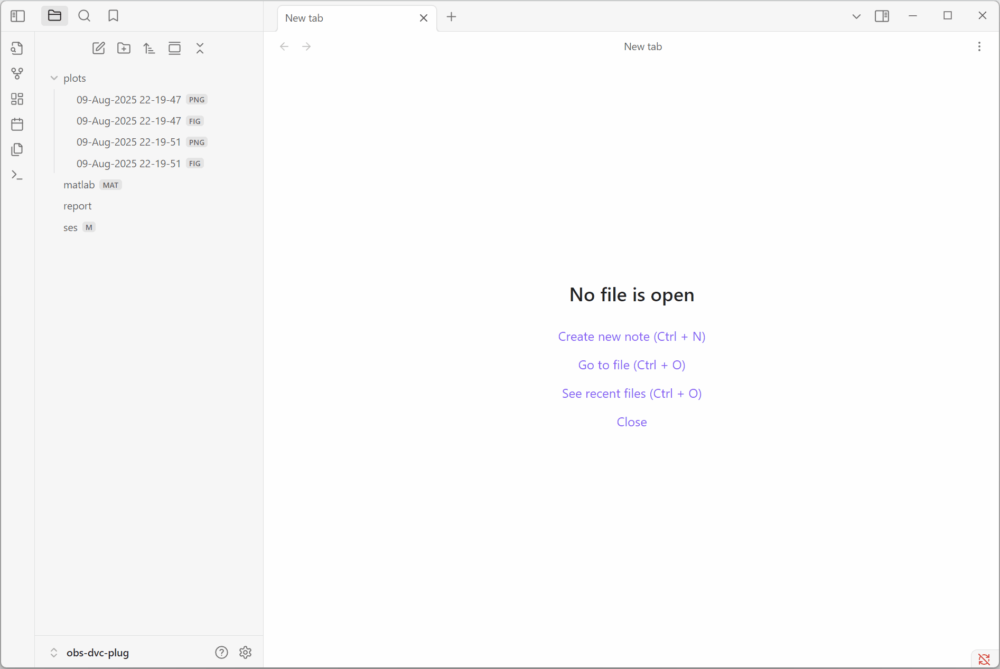
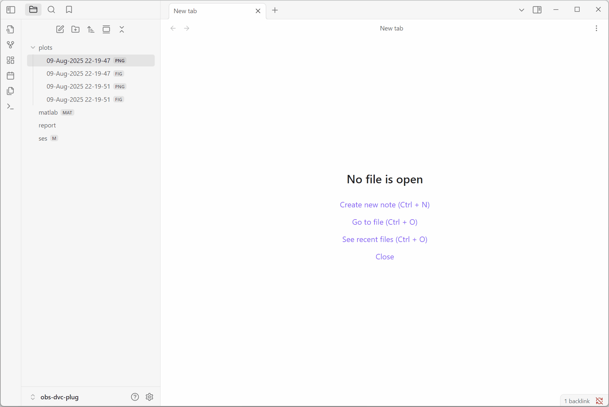
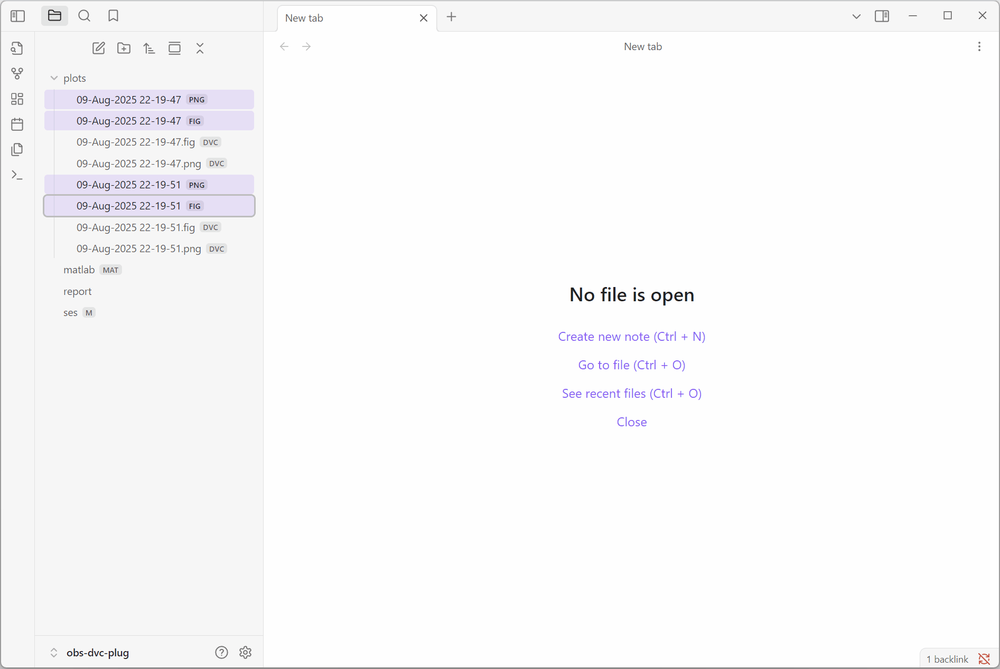
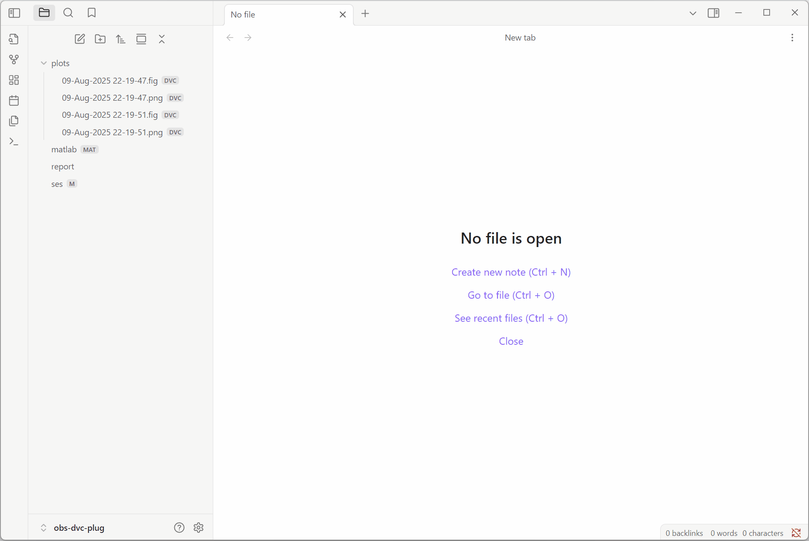

## Obsidian DVC (Data Version Control) Plugin

Manage and version data by [`dvc`](https://dvc.org/) toolkit in the Obsidian environment.
Plugin is inspired to improve collaboration work by management large files 
that are not necessary to track and/or cache by git directly.
It is applicable to log the laboratory routine, data processing result etc.

#### Functionality
Following features are implemented:
- file contex menu of `dvc` commands
- auto pulling markdown attachments by specified file extensions

#### Requirements
1. It's necessary have pre installed softwares:
    - git
    - python
2. Also installed [`dvc`](https://dvc.org/doc/install) package:

    ```bash
    pip install dvc
    ```

#### Preparing
- initialize [`git`](https://git-scm.com/docs/git-init) and [`dvc`](https://dvc.org/doc/command-reference/init) inside Obsidian vault directory by following commands
    
    ```bash
    git init & dvc init
    ```

    or enable the plugin and execute Obsidian command `dvc: init`

- create [remote](https://dvc.org/doc/command-reference/remote) `storage` (for example) by following command

    ```bash
    dvc remote add -d storage <storage-path>
    ```

#### Restriction
This plugin is only compatible with desktop devices.

## Examples

- Append to stage a single file:

    

- Append to stage multiple files:

    

- Push to remote multiple files:

    

- Pull from remote multiple files:

    

- Enable auto markdown attachments pulling:

    